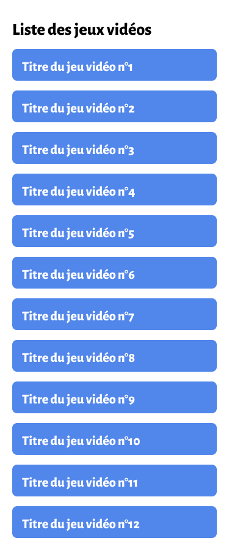
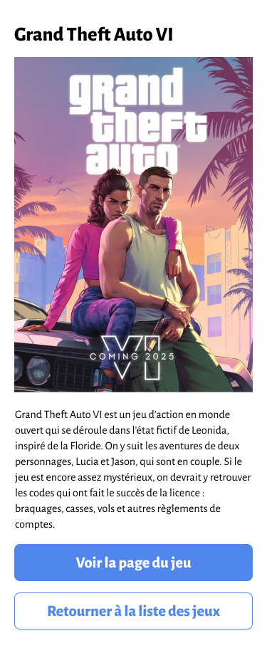
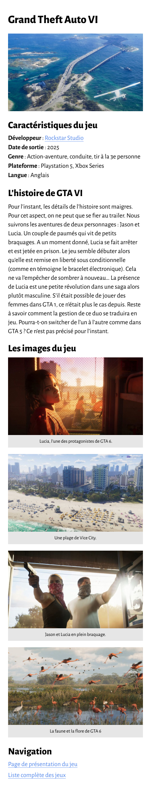

# CSS "Video Game"

> HTML/CSS exercise given at HEPL

* * *

**CSS "Video Game"** is an educational project, which will be used for `HTML`/`CSS` courses.

**Note:** the school where the course is given, the [HEPL](http://www.provincedeliege.be/hauteecole) from Liège, Belgium, is a french-speaking school. From this point, the instruction will be in french. Sorry.

* * *

> Lors de vos labos de *travaux dirigés* (TD), vous allez découvrir le langage CSS et le mettre en pratique via de courts exercices de mise en situation.
> Les labos de *travaux pratiques* (TP) vont vous confronter à des exercices pratiques et individuels reprenant la matière vue lors du TD précédent.

* * *

## Objectif d'apprentissage

À travers cet exercice, vous allez apprendre à maîtriser le modèle boîte ainsi qu'à convertir des unités absolues (`px`) en unités relatives (`em` et `%`).

À l'issue de cette exercice, vous réaliserez une correction en binôme à l'aide de la solution disponible via le bouton `main`. Cliquez sur ce bouton et sélectionnez la branche `completed`. La solution apparaîtra dans la liste des fichiers.

Une fois cette correction réalisée, nous mettrons tous les fichiers en commun afin de les liers les uns aux autres pour faire un micro-site. Cela nous donnera également l'occasion de faire une synthèse avec le groupe classe et de crééer ou d'ajuster les outils/aides disponibles avant de passer à l'évaluation.

Cet exercice représente une étape intermédiaire imporante dans le cours car elle permet de vous préparer à l'évaluation qui suivra cette activité. La pondération de cette évaluation 12.5% de votre cote et vous permettra de situer votre apprentissage.

## Séquencier

| Dates   |     Tâche      | 
|----------|:-------------:|
| 11/03 et 12/03  |  Réalisation de l'exercice |
| 18/03 et 19/03  |  Réalisation de l'exercice |
| 25/03 et 26/03  |  Correction de l'exercice en binôme |

## Consignes

Pour réaliser cet exercice, téléchargez le dossier en cliquant sur le bouton vert code et cliquez sur *download zip*.

Une fois que vous avez téléchargé le fichier, allez dans votre dossier de téléchargement et dézippez-le. Sur MacOS, il suffit de double cliquer, sur Windows, cliquez droit sur le fichier zip et décompressez via 7zip (*extract here*).

Démarrez ensuite votre éditeur de code favori (Visual Studio Code ou Sublime Text sur les machines de l'école) et faites glisser le dossier de l'énoncé dans l'éditeur.

Ouvrez Figma ou Adobe XD afin d'afficher le rendu à obtenir. Celui-ci se trouve dans le dossier rendus.

Pensez à installer les polices. Sur Windows, il vous suffit de les sélectionner et de cliquer droit pour les installer. Sur MacOS, vous pouvez également les installer de la même manière mais il vous faudra le faire individuellement. La police utilisée est [Alegreya Sans](https://fonts.google.com/specimen/Alegreya+Sans) disponible sur Google Fonts. Vous y retrouverez les détails concernant les niveaux de graisse.

Pour cet exercice, vous devez utiliser un reset indépendant de votre code. Vous trouverez le code nécessaire à l'adresse suivante&nbsp;: [https://meyerweb.com/eric/tools/css/reset/](https://meyerweb.com/eric/tools/css/reset/). Pour rappel, les fichiers css doivent se trouver dans un dossier `css` dédié.

Vous remarquerez que chaque balise `HTML` dispose d'une ou plusieurs classes. Préférez l'utilisation des classes aux sélecteurs de type (balises)&nbsp;! Évitez de recopier manuellement les noms de classes et utilisez le copier/coller.

Afin de travailler dans des conditions optimales, pensez à activer la vue adaptative dans votre navigateur. Pour l'activer, ouvrez l'inspecteur dans votre navigateur et cliquez sur l'icône qui représente des périphériques mobiles (le plus souven un téléphone et une tablette).

## Personnalisation

Vous êtes invité à personnaliser le contenu du site en choisissant le jeu vidéo de votre choix. Vous pouvez donc remplacer les textes et informations de présentation ainsi que les images.

## Aides

N'hésitez pas à vous aider des ressources à votre disposition :
- [MDN (Mozilla Developer Network)](https://developer.mozilla.org/fr/docs/Web/CSS)
- [css-steptools](https://github.com/tecg-cpw/css-steptools)
- Pocket Reference
- CSS Cheat Sheet

### Aides supplémentaires&nbsp;:
- [La propriété display](https://developer.mozilla.org/fr/docs/Web/CSS/display)

## Rendus

